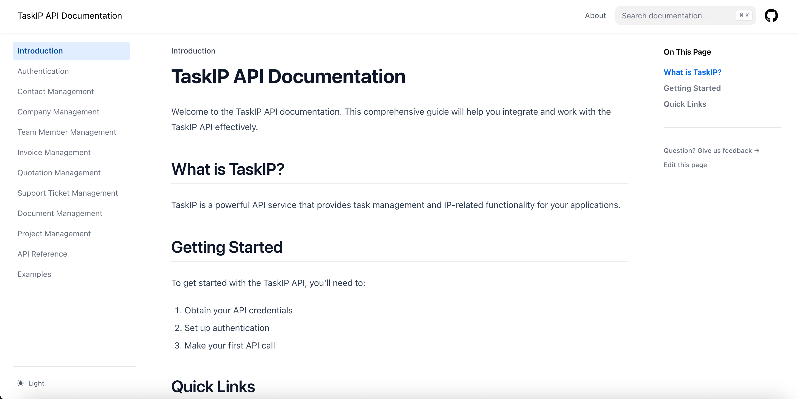

# Taskip API Documentation

Comprehensive API documentation for the Taskip CRM system - your all-in-one client portal software for agencies and freelancers.



## 🚀 Why Use Taskip API?

The Taskip API empowers developers to seamlessly integrate powerful agency management features into their applications:

- **Automate Client Operations**: Programmatically manage contacts, companies, and team members
- **Streamline Billing**: Integrate invoice generation and payment tracking directly into your workflows
- **Project Management**: Create, update, and track projects with full task management capabilities
- **Customer Support**: Build custom support ticket systems with our comprehensive API
- **Document Handling**: Manage files, documents, and version control programmatically
- **Real-time Data Access**: Get instant access to your agency's data across all modules

## 📚 What This Documentation Provides

### For Developers

- **Complete API Reference**: Detailed documentation for 100+ endpoints across all Taskip modules
- **Authentication Guide**: Step-by-step setup for secure API access using X-Secret-Key
- **Code Examples**: Ready-to-use examples in JavaScript, Python, PHP, and cURL for every endpoint
- **Integration Patterns**: Best practices for common integration scenarios
- **Error Handling**: Comprehensive error codes and troubleshooting guides

### Key Features

- **Interactive Navigation**: Easily browse through organized API sections
- **Real-world Examples**: Practical code snippets you can copy and adapt
- **Environment Flexibility**: Configure API endpoints for development, staging, and production
- **Response Schemas**: Clear JSON response structures for all API calls
- **Rate Limiting Info**: Understanding and working with API limits

## 🔌 Available API Modules

| Module | What You Can Build | Endpoints |
|--------|-------------------|-----------|
| **Authentication** | Secure API access management | Setup & configuration |
| **Contacts** | CRM systems, contact synchronization | 7 endpoints |
| **Companies** | Business management, sales pipelines | 6 endpoints |
| **Invoices** | Billing automation, payment tracking | 11 endpoints |
| **Quotations** | Estimate generation, conversion tracking | 9 endpoints |
| **Projects** | Task management, project tracking | 35+ endpoints |
| **Support Tickets** | Help desk systems, customer service | 12 endpoints |
| **Documents** | File management, document storage | 17 endpoints |
| **Team Members** | User management, role assignments | 6 endpoints |

## 🎯 Perfect For

- **SaaS Developers**: Integrate Taskip features into your software
- **Agency Tools**: Build custom dashboards and reporting tools
- **Automation Engineers**: Create workflows between Taskip and other services
- **Mobile App Developers**: Power mobile apps with Taskip's backend
- **Integration Specialists**: Connect Taskip with third-party services

## 🛠️ Quick Integration Example

```javascript
// Get all contacts
const response = await fetch('https://public-api.taskip.net/api/public-v1/contacts', {
  headers: {
    'X-Secret-Key': 'your-api-key',
    'Content-Type': 'application/json'
  }
});

const contacts = await response.json();
```

## 📖 Explore the Documentation

Visit our comprehensive API documentation to:
- Get your API credentials
- Explore all available endpoints
- View detailed request/response examples
- Learn integration best practices

## 💬 Support & Resources

- **API Support**: contact@taskip.net
- **GitHub Issues**: [Report bugs or request features](https://github.com/Taskip-CRM/public-api/issues)
- **Taskip Platform**: [taskip.net](https://taskip.net)

---

Built with ❤️ for developers who want to extend and integrate with Taskip's powerful agency management platform.